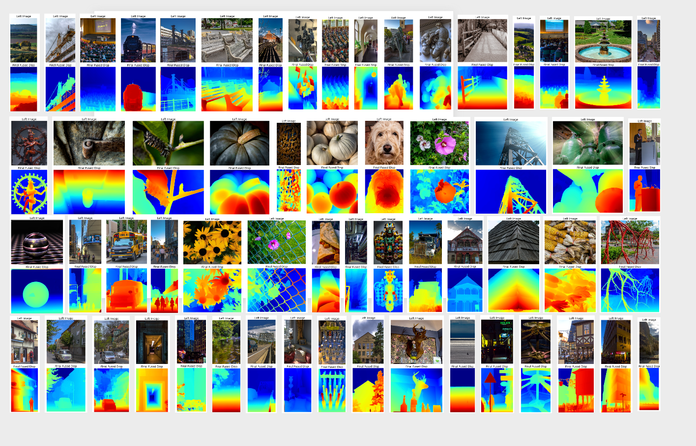

<h1 align="center" style="border-bottom: 0;"> [ICCV25 Oral] Diving into the Fusion of Monocular Priors for Generalized Stereo Matching </h1> 

<p align="center">
  <a href="https://huggingface.co/spaces/AdamYao/Diving-into-the-Fusion-of-Monocular-Priors-for-Generalized-Stereo-Matching"></a>
  &nbsp;
  <a href="https://arxiv.org/abs/2505.14414v2"></a>
  &nbsp;
  <a href="https://drive.google.com/file/d/1T1o7soh3p4C_tHzmUd0ZCtnQbVczPmXz/view?usp=sharing"></a>
</p>



Detailed images can be found at [Google Driver](https://drive.google.com/file/d/1u2u_-AgxkdtnkQENEf1d2JjtutwrtCPb/view?usp=sharing)

<!-- > ⚠️ **Warning**: It is highly recommended to view this markdown in a preview format！ -->
<!-- > ⚠️ **Warning**: We strongly recommend researchers retrain the model on GPUs other than A40 for better results. -->


## Requirements
### 1. Build Environment
```shell
conda env create -n MGStereo -f envs/environment_new.yaml
conda activate MGStereo
```

### 2. Prepare Paths
Create symbolic links for the running data, pretrained models, and datasets:
```Shell
ln -s ~/mount/xxx/Runs ./runs
ln -s ~/mount/xxx/Pretrained ./pretrained
ln -s ~/mount/xxx/Depth/Binocular ./datasets
```


## Required Data
```Shell
├── datasets
    ├── sceneflow
        ├── driving                                               
        │   ├── disparity                                         
        │   ├── frames_cleanpass                                  
        │   └── frames_finalpass                                  
        ├── flying3d                                              
        │   ├── disparity                                         
        │   ├── frames_cleanpass                                  
        │   └── frames_finalpass                                  
        └── monkaa                                                
            ├── disparity                                         
            ├── frames_cleanpass                                                                                             
            └── frames_finalpass
    ├── Kitti15
        ├── testing
        │   ├── image_2
        │   └── image_3
        └── training
            ├── disp_noc_0
            ├── disp_noc_1
            ├── disp_occ_0
            ├── disp_occ_1
            ├── flow_noc
            ├── flow_occ
            ├── image_2
            ├── image_3
            └── obj_map
    ├── Kitti12
        ├── testing
        │   ├── calib
        │   ├── colored_0
        │   ├── colored_1
        │   ├── disp_noc
        │   ├── disp_occ
        │   ├── flow_noc
        │   ├── flow_occ
        │   ├── image_0
        │   └── image_1
        └── training
            ├── calib
            ├── colored_0
            └── colored_1
    ├── Middlebury
        └── MiddEval3  
            ├── testF
            ├── testH
            ├── testQ    
            ├── trainingF                               
            ├── trainingH                                         
            └── trainingQ
    ├── ETH3D
        ├── two_view_testing
        └── two_view_training
            ├── delivery_area_1l
            ├── delivery_area_1s
            ├── delivery_area_2l
    ├── Booster
        ├── test
        │   ├── balanced
        │   └── unbalanced
        └── train
            ├── balanced
            └── unbalanced
```


## Code
All codes are provided here, including DepthAnything v2.
Since we modified `dpt.py` to get intermediate features and depth output, please use the modified code.


- ### Training  
    All training script is presented in [script/train_stereo_raftstereo.sh](script/train_stereo_raftstereo.sh) and [script/train_stereo_raftstereo_depthany.sh](script/train_stereo_raftstereo_depthany.sh).
    Please specify the following variable in scripts before training.
    | variable      | meaning                 |
    |---------------|----------------------|
    | `NCCL_P2P_DISABLE`      | We set `NCCL_P2P_DISABLE=1` as the distributed training went wrong at our `A40` GPU.       |
    | `CUDA_VISIBLE_DEVICES`  | avaliable GPU id, e.g., `CUDA_VISIBLE_DEVICES=0,1,2,3`       |
    | `DATASET_ROOT`  | the training dataset path, e.g., `./datasets/sceneflow`        |
    | `LOG_ROOT`      | path to save log file     |
    | `TB_ROOT`       | path to save tensorboard data        |
    | `CKPOINT_ROOT`  | path to save checkpoint       |
    
    
    In order to reproduce our results, please download `depth_anything_v2_vitl.pth` from DepthAnything v2 before training and specify `--depthany_model_dir` in script shell to path of directory where `depth_anything_v2_vitl.pth` is saved. Here, we do not provide the link as it maybe conflicts to the CVPR guideline.
    We also explain the code for ablation study, in which each experiment is mostly controlled by the `--model_name` used in the training shell.
    | `--model_name`      | meaning                 |
    |-----------------|-------------------------|
    | `RaftStereo`          | Original RaftStereo model       |
    | `RaftStereoDisp`      | The output of GRU is a single channel for disparity instead of two channels for optical flow, `Baseline` in Table 3 of the main text.      |
    | `RAFTStereoMast3r`    | The pre-trained MASt3R is used as the backbone, and its features are used for cost volume construction, `RaftStereo + backbone Mast3r` in supplemental text.       |
    | `RaftStereoNoCTX`     | RaftStereo model without context network, `Baseline w/o mono feature` in Table 3 of the main text.   |
    | `RAFTStereoDepthAny`  | RaftStereo model with our monocular encoder, `Baseline + ME` in Table 3 of the main text.       |
    | `RAFTStereoDepthFusion`  | RaftStereo model with our monocular encoder, `Baseline + ME + IDF` in Table 3 of the main text.       |
    | `RAFTStereoDepthBeta`  | RaftStereo model with our monocular encoder and iterative local fusion, `Baseline + ME + ILF` in Table 3 of the main text.       |
    | `RAFTStereoDepthBetaNoLBP`  | RaftStereo model with our monocular encoder and iterative local fusion without LBPEncoder, `L(6)` and `L(7)` in Table 4 of the main text.       |
    | `RAFTStereoDepthMatch`  | RaftStereo model with DepthAnything v2 as feature extractor for cost volume construction, `RaftStereo + backbone DepthAnything` in the supplemental text.       |
    | `RAFTStereoDepthPostFusion`  | RaftStereo model with our monocular encoder, iterative local fusion and post fusion, `Baseline + ME + PF` in Table 3 of the main text.       |
    | `RAFTStereoDepthBetaRefine`  | RaftStereo model with our monocular encoder, iterative local fusion, and global fusion, `Baseline + ME + ILF + GF` in Table 3 of the main text.       |


    |         variable         | meaning                 |
    |--------------------------|-------------------------|
    | `--lbp_neighbor_offsets` | control `LBP Kernel` used in Table 4 of the main text.   |
    | `--modulation_ratio`     | control `r` amplitude parameter used in Table 4 of the main text. |
    | `--conf_from_fea`        | `Cost` or `Hybrid` for `Confidence` used in Table 4 of the main text. |
    | `--refine_pool`          | learning registration parameters via pooling in the supplemental text. |


    The training is launched by following
    ```Shell
    bash ./script/train_stereo_raftstereo_depthany.sh EXP_NAME
    ```
    `EXP_NAME` specifies the experiment name. We use this name to save each log file, tensorboard data, and checkpoint for different experiments. The corresponding file structure is as follows
    ```Shell
    ├── runs
        ├── ckpoint
        │   ├── RaftStereoDepthAny
        │   ├── RaftStereoMast3r
        │   └── RaftStereoNoCTX
        ├── log
        │   ├── RaftStereoDepthAny
        │   ├── RaftStereoMast3r
        │   └── RaftStereoNoCTX
        └── tboard
            ├── RaftStereoDepthAny
            ├── RaftStereoMast3r
            └── RaftStereoNoCTX
    ```
    > ⚠️ **Warning**: **Please follow the training process mentioned in our main text.** We first train the model without the global fusion module. Then, we train the monocular registration of the global fusion module while keeping the other modules frozen with a well-trained model from the first stage. Finally, we train the entire global fusion module while keeping the other modules frozen with a well-trained model from the second stage.

- ### Evaluation  
    The evaluation script is presented in [script/evaluate_stereo_raftstereo.sh](script/evaluate_stereo_raftstereo.sh).
    We use `--test_exp_name` to specify the evaluation experiment name.
    The results of each experiment are restored in `LOG_ROOT/eval.xlsx`. We also merge all experiments' results in `LOG_ROOT/merged_eval.xlsx` through `python3 merge_sheet.py`.
    The evaluation metrics remain the same for different methods.
    The `mean ± std` is computed via [tools/get_statistics.py](tools/get_statistics.py).

- ### Visualization  
    We visualize the error map via [script/gen_sample_stereo_raftstereo.sh](script/gen_sample_stereo_raftstereo.sh) and intermediate results via [script/vis_inter_stereo_raftstereo.sh](script/vis_inter_stereo_raftstereo.sh).
    We provide an easy-to-use visualization toolbox to fully understand each module.

- ### Demo
    The model weights, pre-trained on SceneFlow, can be downloaded from [Google Drive](https://drive.google.com/file/d/1T1o7soh3p4C_tHzmUd0ZCtnQbVczPmXz/view?usp=sharing).
    The demo used to infer disparity maps from custom image pairs is presented in `infer_stereo_raftstereo.py`. For specific usage, please refer to `script/infer_stereo_raftstereo.sh`.


## More Results
The results were obtained by training on our custom synthetic dataset, [Trans Dataset](https://github.com/BFZD233/TranScene), specifically designed for multi-label transparent scenes. The model was trained end-to-end using weights pretrained on the SceneFlow dataset.


<table>
  <thead>
    <tr>
      <th rowspan="3">Method</th>
      <th colspan="21">Booster</th>
    </tr>
    <tr>
      <th colspan="7">ALL</th>
      <th colspan="7">Trans</th>
      <th colspan="7">No_Trans</th>
    </tr>
    <tr>
      <th>EPE</th>
      <th>RMSE</th>
      <th>2px</th>
      <th>3px</th>
      <th>5px</th>
      <th>6px</th>
      <th>8px</th>
      <th>EPE</th>
      <th>RMSE</th>
      <th>2px</th>
      <th>3px</th>
      <th>5px</th>
      <th>6px</th>
      <th>8px</th>
      <th>EPE</th>
      <th>RMSE</th>
      <th>2px</th>
      <th>3px</th>
      <th>5px</th>
      <th>6px</th>
      <th>8px</th>
    </tr>
  </thead>
  <tbody>
    <tr>
      <td>Ours</td>
      <td>2.26</td>
      <td>5.60</td>
      <td>11.02</td>
      <td>8.59</td>
      <td>6.60</td>
      <td>6.00</td>
      <td>5.35</td>
      <td>7.93</td>
      <td>11.03</td>
      <td>59.83</td>
      <td>50.36</td>
      <td>38.44</td>
      <td>33.87</td>
      <td>27.56</td>
      <td>1.52</td>
      <td>3.93</td>
      <td>6.98</td>
      <td>4.97</td>
      <td>3.64</td>
      <td>3.27</td>
      <td>2.89</td>
    </tr>
    <tr>
      <td>Ours+Trans</td>
      <td>1.24</td>
      <td>4.19</td>
      <td>7.91</td>
      <td>5.97</td>
      <td>4.52</td>
      <td>4.08</td>
      <td>3.44</td>
      <td>5.67</td>
      <td>8.42</td>
      <td>46.78</td>
      <td>38.55</td>
      <td>28.65</td>
      <td>25.41</td>
      <td>21.30</td>
      <td>0.75</td>
      <td>3.07</td>
      <td>4.77</td>
      <td>3.23</td>
      <td>2.29</td>
      <td>2.01</td>
      <td>1.59</td>
    </tr>
  </tbody>
</table>

<table>
  <thead>
    <tr>
      <th rowspan="3">Method</th>
      <th colspan="28">Booster</th>
    </tr>
    <tr>
      <th colspan="7">Class 0</th>
      <th colspan="7">Class 1</th>
      <th colspan="7">Class 2</th>
      <th colspan="7">Class 3</th>
    </tr>
    <tr>
      <th>EPE</th>
      <th>RMSE</th>
      <th>2px</th>
      <th>3px</th>
      <th>5px</th>
      <th>6px</th>
      <th>8px</th>
      <th>EPE</th>
      <th>RMSE</th>
      <th>2px</th>
      <th>3px</th>
      <th>5px</th>
      <th>6px</th>
      <th>8px</th>
      <th>EPE</th>
      <th>RMSE</th>
      <th>2px</th>
      <th>3px</th>
      <th>5px</th>
      <th>6px</th>
      <th>8px</th>
      <th>EPE</th>
      <th>RMSE</th>
      <th>2px</th>
      <th>3px</th>
      <th>5px</th>
      <th>6px</th>
      <th>8px</th>
    </tr>
  </thead>
  <tbody>
    <tr>
      <td>Ours</td>
      <td>0.79</td>
      <td>3.02</td>
      <td>5.90</td>
      <td>4.57</td>
      <td>3.17</td>
      <td>2.58</td>
      <td>1.45</td>
      <td>1.53</td>
      <td>4.70</td>
      <td>12.67</td>
      <td>7.80</td>
      <td>4.88</td>
      <td>3.96</td>
      <td>3.14</td>
      <td>5.32</td>
      <td>6.39</td>
      <td>23.34</td>
      <td>17.62</td>
      <td>13.50</td>
      <td>12.80</td>
      <td>12.15</td>
      <td>7.93</td>
      <td>11.03</td>
      <td>59.83</td>
      <td>50.36</td>
      <td>38.44</td>
      <td>33.87</td>
      <td>27.56</td>
    </tr>
    <tr>
      <td>Ours+Trans</td>
      <td>0.75</td>
      <td>2.99</td>
      <td>5.15</td>
      <td>4.08</td>
      <td>3.00</td>
      <td>2.59</td>
      <td>1.73</td>
      <td>1.40</td>
      <td>4.74</td>
      <td>9.17</td>
      <td>5.63</td>
      <td>3.80</td>
      <td>3.37</td>
      <td>2.86</td>
      <td>1.62</td>
      <td>2.26</td>
      <td>13.51</td>
      <td>10.23</td>
      <td>7.40</td>
      <td>6.50</td>
      <td>4.93</td>
      <td>5.67</td>
      <td>8.42</td>
      <td>46.78</td>
      <td>38.55</td>
      <td>28.65</td>
      <td>25.41</td>
      <td>21.30</td>
    </tr>
  </tbody>
</table>

